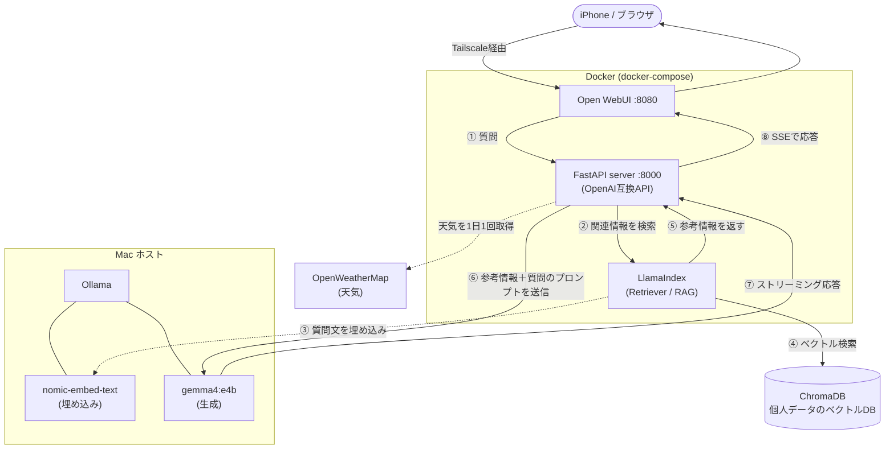
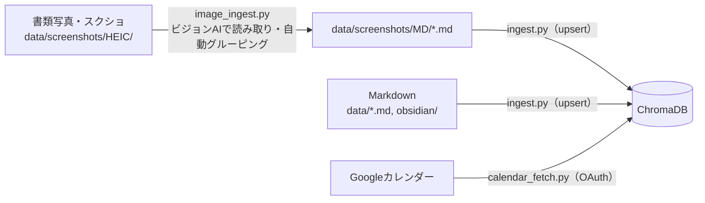

# personalAI

自分専用のローカルAIアシスタント。自分の情報（プロフィール・予定・メモ・書類の写真など）をベクトルDBに取り込み、外部サービスにデータを渡さずプライベートな環境で **RAG検索 × ローカルLLM** を組み合わせて動かすことを目的としたプロジェクトです。iPhoneからも利用できます。

## 概要

「自分のデータをクラウドに預けずに、自分専用のAIを持ちたい」という動機でスタートしました。Open WebUI をフロントに、自前の OpenAI 互換 API サーバー（FastAPI）を挟み、ChromaDB に蓄積した個人データを LlamaIndex で検索して Ollama のローカルLLMに渡します。Tailscale 経由でiPhoneからアクセスでき、日常的に使えるパーソナル秘書AIを目指して継続開発しています。

## 主な機能

| 機能 | 内容 | 実装 |
|------|------|:----:|
| **RAG検索** | LlamaIndex の Retriever で ChromaDB を検索し、関連情報をプロンプトに付与 | ✅ |
| **ローカルLLM・ストリーミング応答** | Ollama（`gemma4:e4b`）で生成。OpenAI互換APIとしてSSEで応答 | ✅ |
| **天気情報の自動付与** | 現在地の天気を1日1回取得し、質問の前に自動で差し込む | ✅ |
| **Markdown取り込み（upsert対応）** | `data/` 以下のMDを ChromaDB に取り込み。重複は更新で防止 | ✅ |
| **画像→Markdown自動グルーピング** | スクショ・書類写真をビジョンAIで読み取り、内容ごとにMD化して取り込み | ✅ |
| **Googleカレンダー連携** | 予定を取得して ChromaDB に格納（OAuth認証） | ✅ |
| **Obsidian自動同期** | iCloud上のVaultを定期的にRAGへ取り込むバッチ | 🚧 未実装※ |

※ Obsidianの自動同期バッチ（`batch/obsidian_sync.py`）は未実装です。現状はMarkdownを `data/` に置けば `ingest.py` で手動取り込みできます。

## アーキテクチャ

### 問い合わせの流れ（オンライン）



### データ取り込みの流れ（バッチ）



## 技術スタック

| カテゴリ | 使用技術 |
|------|------|
| フロントエンド | Open WebUI |
| APIサーバー | FastAPI（OpenAI互換エンドポイント） |
| RAGフレームワーク | LlamaIndex |
| ベクトルDB | ChromaDB |
| LLM実行環境 | Ollama（生成: `gemma4:e4b` / 埋め込み: `nomic-embed-text`） |
| コンテナ管理 | Docker / docker-compose |
| リモートアクセス | Tailscale |
| 外部連携 | Google Calendar API / OpenWeatherMap API |
| 言語 | Python |

## ディレクトリ構成

```
personalAI/
├── src/
│   ├── server.py          # OpenAI互換APIサーバー（Open WebUIから利用）
│   ├── query.py           # CLIからRAGに質問するスクリプト
│   └── weather_fetch.py   # 天気情報の取得
├── batch/
│   ├── ingest.py          # data/ のMDをChromaDBに取り込み（upsert）
│   ├── image_ingest.py    # 画像をビジョンAIで読み取りMD化
│   ├── calendar_fetch.py  # Googleカレンダーの予定を取り込み
│   └── obsidian_sync.py   # Obsidian自動同期（未実装）
├── data/                  # 個人データ（.gitignore対象）
├── secrets/               # 認証情報（.gitignore対象）
├── chroma_db/             # ベクトルDBの実体（.gitignore対象）
├── docker-compose.yml
└── Dockerfile
```

## セットアップ

### 前提条件

- Docker / docker-compose
- [Ollama](https://ollama.com/)（**ホスト側で**起動しておくこと）
- 必要なモデルを事前に取得：

  ```bash
  ollama pull gemma4:e4b        # 生成用LLM
  ollama pull nomic-embed-text  # 埋め込み用モデル
  ```

- `secrets/` 以下に認証情報を配置（いずれも `.gitignore` 済み）：
  - `weather.json` … OpenWeatherMap の APIキー（天気機能を使う場合）
  - `credentials.json` / `token.json` … Google Calendar API の認証情報（カレンダー連携を使う場合）

### 起動

```bash
git clone https://github.com/chris9609/personalAI.git
cd personalAI
docker-compose up
```

起動後、ブラウザで `http://localhost:8080`（Open WebUI）にアクセスして利用します。Tailscale を設定すれば、同じURLにiPhoneなど外部端末からもアクセスできます。

## データの取り込み（バッチ）

```bash
# data/ 配下のMarkdownを取り込み
python batch/ingest.py

# 画像（data/screenshots/HEIC/）を読み取ってMD化 → そのあと ingest.py で取り込み
python batch/image_ingest.py

# Googleカレンダーの予定を取り込み（初回はブラウザで認証）
python batch/calendar_fetch.py --days 7
```

## 今後の予定

- Obsidian Vault（iCloud同期）を定期的にRAGへ取り込む夜間バッチの実装
- 取り込み処理の高速化
- iPhoneからの利用体験の改善

## 開発の背景

iPhoneからローカルLLMに質問できる「自分専用の秘書AI」を作ることがゴールです。プロフィールや予定、メモ、書類の写真といった個人のコンテキストをローカルのベクトルDBに蓄積し、クラウドにデータを渡さずに自分を理解したAIと会話できる環境を、ポートフォリオも兼ねて継続開発しています。
