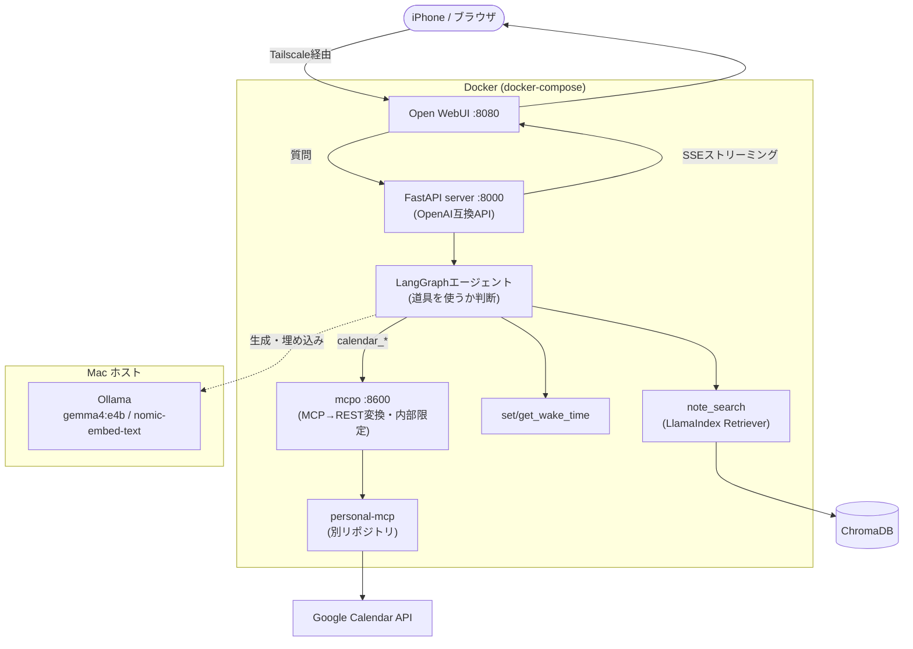
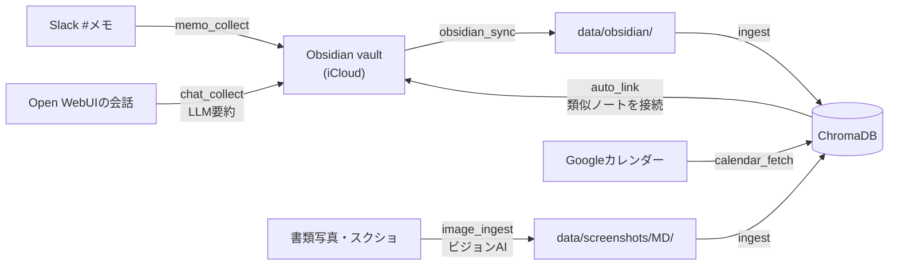
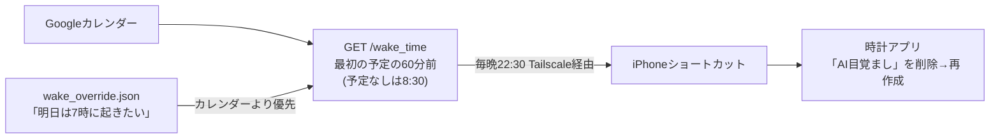

# personalAI

自分専用のローカルAI秘書。自分の情報（プロフィール・予定・メモ・会話・書類の写真など）をベクトルDBに蓄積し、外部サービスにデータを渡さずプライベートな環境で **エージェント × RAG × ローカルLLM** を組み合わせて動かすプロジェクトです。iPhoneからも利用できます。

## 概要

「自分のデータをクラウドに預けずに、自分専用のAIを持ちたい」という動機でスタートしました。Open WebUI をフロントに、自前の OpenAI 互換 API サーバー（FastAPI）を挟み、**LangGraph のエージェント**が「そのまま答えるか、道具を使うか」を判断して応答します。道具はローカルRAG検索（LlamaIndex + ChromaDB）、Googleカレンダー操作（MCP経由）、目覚まし設定など。

さらに毎晩のバッチが Slack のメモや AI との会話を Obsidian vault に回収・要約し、ノート同士を自動リンクして RAG に取り込みます。**「日中に見聞きしたことが、翌朝には AI 自身の記憶になっている」** サイクルを回すことを目指しています。

## 主な機能

### 会話AI（LangGraphエージェント）

Open WebUI からの質問を受け、エージェントが必要に応じて道具を呼び出してから回答します。

| 道具 / 仕組み | 内容 |
|------|------|
| `note_search` | LlamaIndex Retriever で ChromaDB を検索（ノート・画像の内容・予定の記録） |
| `calendar_*` | Googleカレンダーの予定の追加・確認・変更・削除。**mcpo の openapi.json から起動時に自動生成**するため、MCP側でツールを増やしてもコード修正不要 |
| `set_wake_time` / `get_wake_time` | 「明日は7時に起きたい」で目覚ましを手動設定・確認。「やっぱりカレンダー通りで」で解除 |
| 会話履歴・日付認識 | 直近20メッセージの履歴と現在日時をシステムプロンプトで毎回付与（「明日」「来週」を正しく計算） |
| 天気の自動付与 | 現在地の天気を1日1回取得してプロンプトに差し込み |
| ツール偽装対策 | 小型モデルが道具を呼ばずに「追加しました」と嘘の完了報告をする問題をプロンプトで抑止 |

### 目覚まし自動設定（iPhoneショートカット連携）

カレンダーの予定から起床時刻を計算し、iPhoneの時計アプリに毎晩自動セットします。

- 起床時刻 = その日最初の予定の **60分前**（予定なしは8:30。8:30より遅くはしない）
- 会話で「明日は7時に起きたい」と言えば手動上書き（`data/wake_override.json`、カレンダーより優先）
- iPhoneショートカットが毎晩22:30に `GET /wake_time` を叩き、「AI目覚まし」アラームを削除→再作成
- Mac に届かない夜は前日の時刻のまま鳴る（繰り返しアラームを保険にした設計）

### 夜間バッチ — 記憶の定着（毎晩5:00）

fail-fast のパイプラインで、1日の情報を vault → ChromaDB へ流し込みます。

| 順 | スクリプト | 内容 |
|:--:|------|------|
| 1 | `memo_collect.py` | Slack #メモ の投稿を vault の inbox/ へ回収（処理済みは✅リアクションで管理） |
| 2 | `chat_collect.py` | Open WebUI の会話をLLMが要約して vault へ（記録する価値があるかも LLM が判断） |
| 3 | `obsidian_sync.py` | iCloud 上の Obsidian vault を `data/obsidian/` に同期 |
| 4 | `image_ingest.py` | スクショ・書類写真をビジョンAIで読み取り、内容ごとに自動グルーピングしてMD化 |
| 5 | `ingest.py` | `data/` 以下のMDを ChromaDB に取り込み（upsert対応） |
| 6 | `auto_link.py` | 埋め込みのコサイン類似度でノート同士を Obsidian の `[[リンク]]` で自動接続 |
| 7 | `calendar_fetch.py` | Googleカレンダーの予定を ChromaDB に取り込み |

### 朝の配信・学習支援（Slack）

| スクリプト | 実行 | 内容 |
|------|------|------|
| `morning_briefing.py` | 毎朝8:00 | 今日の予定と Anki 残数を #秘書室 に投稿 |
| `news_digest.py` | 毎朝8:10 | AIニュース（RSS）をLLMで英語要約して #AIニュース に配信。日本語訳はスレッドに畳む学習動線 |
| `english_assistant.py` | 毎分 | #英語 チャンネルの見張り番。投稿に翻訳・例文を自動返信し、📌を付けた単語は音声付きで Anki カード化（edge-tts） |

### 運用・監視

- バッチ失敗は **どのステップで死んだかを Slack #エラー へ即通知**（trap ERR + fail-fast）
- 成功しても異常に遅い場合（30分超）は通知（「7時間半かかっても無音」だった死角への対策）
- Ollama が落ちている夜は残りをスキップして正常終了（次回自然に回復）

## アーキテクチャ

### 会話の流れ（オンライン）


```mermaid
flowchart TD
    iPhone([iPhone / ブラウザ])
    iPhone -->|Tailscale経由| WebUI

    subgraph Docker["Docker (docker-compose)"]
        WebUI["Open WebUI :8080"]
        API["FastAPI server :8000<br/>(OpenAI互換API)"]
        Agent["LangGraphエージェント<br/>(道具を使うか判断)"]
        RAG["note_search<br/>(LlamaIndex Retriever)"]
        Wake["set/get_wake_time"]
        MCPO["mcpo :8600<br/>(MCP→REST変換・内部限定)"]
        WebUI -->|質問| API --> Agent
        Agent --> RAG
        Agent --> Wake
        Agent -->|calendar_*| MCPO
        MCPO --> MCP["personal-mcp<br/>(別リポジトリ)"]
    end

    subgraph Host["Mac ホスト"]
        Ollama["Ollama<br/>gemma4:e4b / nomic-embed-text"]
    end

    Chroma[("ChromaDB")]
    GCal["Google Calendar API"]

    RAG --> Chroma
    Agent -.->|生成・埋め込み| Ollama
    MCP --> GCal
    API -->|SSEストリーミング| WebUI --> iPhone
```

### 記憶のサイクル（夜間バッチ）


```mermaid
flowchart LR
    Slack["Slack #メモ"] -->|memo_collect| Vault["Obsidian vault<br/>(iCloud)"]
    Chat["Open WebUIの会話"] -->|chat_collect<br/>LLM要約| Vault
    Vault -->|obsidian_sync| Data["data/obsidian/"]
    Images["書類写真・スクショ"] -->|image_ingest<br/>ビジョンAI| Data2["data/screenshots/MD/"]
    Data -->|ingest| Chroma[("ChromaDB")]
    Data2 -->|ingest| Chroma
    Chroma -->|auto_link<br/>類似ノートを接続| Vault
    Calendar["Googleカレンダー"] -->|calendar_fetch| Chroma
```

### 目覚ましの流れ


```mermaid
flowchart LR
    GCal["Googleカレンダー"] --> WT["GET /wake_time<br/>最初の予定の60分前<br/>(予定なしは8:30)"]
    Override["wake_override.json<br/>「明日は7時に起きたい」"] -->|カレンダーより優先| WT
    WT -->|毎晩22:30 Tailscale経由| SC["iPhoneショートカット"]
    SC --> Clock["時計アプリ<br/>「AI目覚まし」を削除→再作成"]
```

## 技術スタック

| カテゴリ | 使用技術 |
|------|------|
| フロントエンド | Open WebUI |
| APIサーバー | FastAPI（OpenAI互換エンドポイント） |
| エージェント | LangGraph / LangChain（ReActエージェント + StructuredTool） |
| RAGフレームワーク | LlamaIndex |
| ベクトルDB | ChromaDB |
| LLM実行環境 | Ollama（生成: `gemma4:e4b` / 埋め込み: `nomic-embed-text`） |
| ツール連携 | MCP（personal-mcp）+ mcpo（MCP→REST変換） |
| コンテナ管理 | Docker / docker-compose |
| リモートアクセス | Tailscale |
| 外部連携 | Google Calendar API / OpenWeatherMap / Slack API / Anki（AnkiConnect） / edge-tts / RSS |
| 自動化 | cron（Mac） / iPhoneショートカット・オートメーション |
| 言語 | Python |

## ディレクトリ構成

```
personalAI/
├── src/
│   ├── server.py            # OpenAI互換APIサーバー + LangGraphエージェント
│   ├── wake_time.py         # 起床時刻の計算 + 手動オーバーライド
│   ├── weather_fetch.py     # 天気情報の取得
│   └── query.py             # CLIからRAGに質問するスクリプト
├── batch/
│   ├── ingest.py            # data/ のMDをChromaDBに取り込み（upsert）
│   ├── obsidian_sync.py     # iCloudのvaultを data/ に同期
│   ├── chat_collect.py      # Open WebUIの会話をLLM要約してvaultへ
│   ├── memo_collect.py      # Slack #メモ をvaultへ回収
│   ├── auto_link.py         # ノート同士を意味の近さで自動[[リンク]]
│   ├── image_ingest.py      # 画像をビジョンAIで読み取りMD化
│   ├── calendar_fetch.py    # Googleカレンダーの予定を取り込み
│   ├── morning_briefing.py  # 朝ブリーフィング（#秘書室）
│   ├── news_digest.py       # AIニュース便（#AIニュース）
│   └── english_assistant.py # 英語学習アシスタント（#英語）
├── data/                    # 個人データ（.gitignore対象）
├── secrets/                 # 認証情報（.gitignore対象）
├── chroma_db/               # ベクトルDBの実体（.gitignore対象）
├── docker-compose.yml       # server / open-webui / mcpo の3サービス
└── Dockerfile
```

## セットアップ

### 前提条件

- Docker / docker-compose
- [Ollama](https://ollama.com/)（**ホスト側で**起動しておくこと）
- 必要なモデルを事前に取得：

  ```bash
  ollama pull gemma4:e4b        # 生成用LLM
  ollama pull nomic-embed-text  # 埋め込み用モデル
  ```

- カレンダー操作ツールを使う場合は、隣のディレクトリに [personal-mcp](../MCP) リポジトリが必要（mcpo サービスがビルドに使用。公開ツールは `docker-compose.yml` の `TOOLS` 環境変数で選択）
- `secrets/` 以下に認証情報を配置（いずれも `.gitignore` 済み）：
  - `weather.json` … OpenWeatherMap の APIキー（天気機能を使う場合）
  - `credentials.json` / `token.json` … Google Calendar API の認証情報（カレンダー連携を使う場合）

### 起動

```bash
git clone https://github.com/chris9609/personalAI.git
cd personalAI
docker-compose up
```

起動後、ブラウザで `http://localhost:8080`（Open WebUI）にアクセスして利用します。Tailscale を設定すれば、同じURLにiPhoneなど外部端末からもアクセスできます。

## バッチの実行スケジュール（cron）

| 時刻 | 内容 |
|------|------|
| 毎晩 5:00 | 夜間バッチ（memo_collect → chat_collect → obsidian_sync → image_ingest → ingest → auto_link → calendar_fetch） |
| 毎朝 8:00 | 朝ブリーフィング → #秘書室 |
| 毎朝 8:10 | AIニュース便 → #AIニュース |
| 毎分 | 英語学習アシスタント（#英語 の見張り番） |
| 毎晩 22:30 | iPhoneショートカットが目覚ましを自動セット（iPhone側オートメーション） |

※ Mac は電源接続が前提（バッテリー駆動だとスリープして cron が沈黙するため）。手動実行する場合：

```bash
# 例: data/ 配下のMarkdownを取り込み
.venv/bin/python -m batch.ingest

# 例: Googleカレンダーの予定を取り込み（初回はブラウザで認証）
.venv/bin/python -m batch.calendar_fetch
```

## 今後の予定

- エージェントの道具を拡充（mcpo の `TOOLS` に Anki・Slack を追加）
- RAG検索の精度改善
- 経路検索（乗換案内）の道具化
- 取り込み処理の高速化

## 開発の背景

iPhoneからローカルLLMに相談できる「自分専用の秘書AI」を作ることがゴールです。プロフィールや予定、メモ、AIとの会話、書類の写真といった個人のコンテキストをローカルに蓄積し、クラウドにデータを渡さずに自分を理解したAIと暮らす環境を、ポートフォリオも兼ねて継続開発しています。
